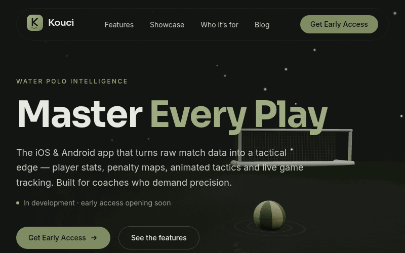

<div align="center">

# Kouci — Master Every Play

**The iOS & Android app that turns raw water polo match data into a tactical edge.**

Player stats · Penalty shot maps · Animated tactics · Live match tracking

[**Live site**](https://kouci-web.vercel.app) · [Request early access](https://kouci-web.vercel.app/#early-access) · [Blog](https://kouci-web.vercel.app/blog)

[](https://github.com/ProgAnakin/kouci_web/actions/workflows/ci.yml)




</div>

## Why Kouci?

Water polo moves fast — decisions shouldn't rely on memory. Kouci gives coaches
and analysts:

- **Roster management** — player profiles, positions and caps, tracked across
  the season.
- **Penalty shot intelligence** — every 5-metre plotted on the goal mouth:
  placement, outcome, keeper tendencies.
- **Animated tactics** — draw a set play once, animate it in 3D, export it as
  video/GIF and send it straight to the squad.
- **Live match stats** — log events in real time; season numbers are ready at
  the final whistle.

Built for head coaches, analysts, clubs and federations who demand precision.

---

## This repository

This is Kouci's public landing site — dark, sporty, and built around an
interactive 3D pool scene (the ball and goal above are rendered live in WebGL,
not a video).

### Stack

- **Vite + React + TypeScript**, statically generated with **vite-react-ssg**
  (every route ships real HTML + per-page meta and JSON-LD)
- **Three.js** via **React Three Fiber** + **@react-three/drei**
- **GSAP** (ScrollTrigger) + **Lenis** smooth scroll; **maath** easing for the camera
- **Tailwind CSS** for all 2D UI · **Vercel Analytics** with a signup conversion event

The hero's cinematic grade is done **without a post-processing library** (to
keep the bundle light and hold 60fps): ACES Filmic tone mapping, MSAA, a faux
bloom sprite and a CSS vignette. WebGL 2 with automatic fallback to WebGL 1 —
WebGPU is intentionally not assumed.

## Getting started

```bash
npm install      # also installs the Husky pre-commit hook
npm run dev      # start the dev server (http://localhost:5173)
npm run build    # sitemap + type-check + static-generate the site → dist/
npm run preview  # preview the production build locally
npm run check    # type-check + lint + format check (what CI runs)
```

Node 18+ recommended.

## Project structure

```
src/
├─ App.tsx                 # routes (landing, /blog, /blog/:slug, /privacy)
├─ RootLayout.tsx          # navbar/footer shell shared by every route
├─ index.css               # Tailwind layers + palette CSS variables
├─ lib/
│  ├─ theme.ts             # palette as TS values (for Three.js)
│  ├─ site.ts              # canonical URL + socials (SEO)
│  ├─ blog.ts              # markdown posts → typed data (build time)
│  └─ scrollStore.ts       # GSAP ↔ R3F scroll bridge (no re-renders)
├─ hooks/
│  ├─ usePrefersReducedMotion.ts
│  ├─ usePageScroll.ts        # ScrollTrigger → scrollStore
│  ├─ useSmoothScroll.ts      # Lenis inertial scroll
│  └─ useCanvasActivation.ts  # defer-mount heavy canvases + pause off-screen
├─ content/blog/           # the blog: one .md file per post (no CMS)
├─ pages/                  # LandingPage, BlogIndex, BlogPost, Privacy, NotFound
├─ components/
│  ├─ layout/              # Navbar, Footer
│  ├─ sections/            # Hero, Promise, Features, Showcase, Audience, EarlyAccess
│  ├─ ui/                  # Button, Field, Reveal, ErrorBoundary, …
│  └─ Seo.tsx              # per-page title/OG/Twitter/JSON-LD
└─ three/                  # all the WebGL
   ├─ HeroCanvas.tsx       # pool scene: sky + lighting + ball + goal (lazy)
   ├─ hero/                # Water, Ball, Goal, BallScene, effects, constants
   ├─ CameraRig.tsx        # low cinematic camera (maath damping + ball follow)
   ├─ TacticsCanvas.tsx    # field + caps + animated 3D arrows (lazy)
   ├─ PenaltyCanvas.tsx    # goal + plotted shots (lazy)
   └─ Loader.tsx           # in-canvas + DOM loaders
```

## Theming / palette

The brand palette is defined in **three** mirrored places — keep them in sync:

| Token         | Hex       | Tailwind      | CSS var               |
| ------------- | --------- | ------------- | --------------------- |
| Background    | `#131512` | `bg`          | `--color-bg`          |
| Surface       | `#1F221B` | `surface`     | `--color-surface`     |
| Brand (olive) | `#7E8B63` | `brand`       | `--color-brand`       |
| Brand light   | `#9FAC82` | `brand-light` | `--color-brand-light` |
| Silver        | `#C5C9C0` | `silver`      | `--color-silver`      |
| Text          | `#E6E8E2` | `ink`         | `--color-ink`         |

- Tailwind tokens: `tailwind.config.js`
- CSS variables: `src/index.css`
- TypeScript values (used in Three.js): `src/lib/theme.ts`

## Where to plug things in

- **Email capture** → `src/components/sections/EarlyAccess.tsx` posts to
  **Formspree** via `VITE_FORMSPREE_ENDPOINT` (see `.env.example`); set that in
  your environment and in the host's env vars.
- **Blog posts** → add a Markdown file with frontmatter to
  `src/content/blog/`; it's picked up at build time (no CMS). Images and cover
  art go in `public/assets/blog/` — see that folder's `README.md`.
- **Analytics** → Vercel Analytics is wired in `App.tsx`, with an
  `early_access_signup` conversion event fired on a successful signup.
- **Social links** → live Kouci profiles in `src/components/layout/Footer.tsx`
  (toggle each with its `enabled` flag).
- **Canonical domain** → update `SITE_URL` in `src/lib/site.ts` (and the same
  value in `scripts/gen-seo.mjs`) when the custom domain lands.

## Performance notes

- Heavy 3D scenes are **code-split** (`React.lazy`). `useCanvasActivation`
  defers each canvas's mount to **browser-idle** and **pauses its render loop
  when scrolled off-screen** (`frameloop="never"`), so idle canvases don't
  fight the scroll.
- The hero shows a **static poster instantly** and crossfades the 3D in once
  the renderer is ready; each canvas is wrapped in an **ErrorBoundary** that
  falls back to the poster if WebGL fails.
- Repeated 3D elements (pins, shot markers, spray) use **instancing**; the
  water is a single shader-displaced plane; mobile drops subdivision counts
  and caps the device pixel ratio (`AdaptiveDpr`).
- Generated textures and materials are **explicitly disposed** on unmount.

## Accessibility

- A parallel, screen-reader-only description accompanies each 3D scene;
  decorative canvases are hidden from assistive tech.
- `prefers-reduced-motion` freezes the water, camera, arrows and DOM reveals
  (even the wave in this README stops).
- Skip link, semantic landmarks, on-brand focus rings, and a fully validated,
  keyboard-operable signup form.

## Contributing

PRs welcome — see [CONTRIBUTING.md](./CONTRIBUTING.md). `npm run check` and
`npm run build` must pass; a Husky pre-commit hook lints staged files, and CI
runs the same checks.

## Deploy

Static output — deploy `dist/` anywhere. For **Vercel** or **Netlify**:

- Build command: `npm run build`
- Output directory: `dist`
- Env var: `VITE_FORMSPREE_ENDPOINT`

<div align="center">


**Made for water polo.** 🤽

</div>
